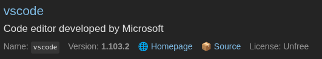
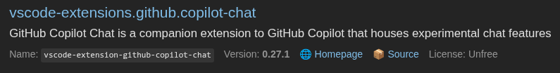
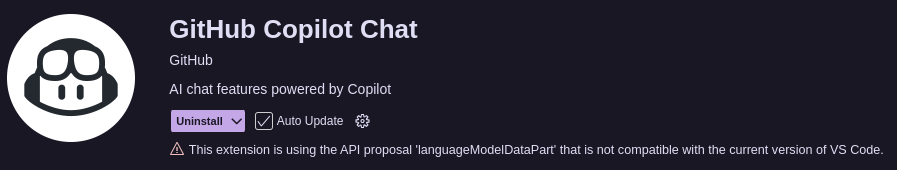
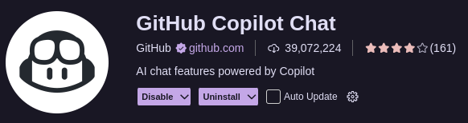

# Handling VS Code editor and extension version conflicts in Nixos

## Summary
When you use a basic declarative syntax to manage your vscode installation via home-manager, you can encounter issues where your vscode version conflicts with an extension version.

## Explanation
For instance, if your configuration was:
```
programs.vscode = {
  enable = true;
  profiles.default = {
    extensions = with pkgs.vscode-extensions; [
      jnoortheen.nix-ide
      github.copilot
      github.copilot-chat
    ];
    userSettings = {
      "[nix]" = {
        "editor.defaultFormatter" = "jnoortheen.nix-ide";
        "editor.formatOnSave" = true;
      };
      "nix.enableLanguageServer" = true;
      "nix.serverPath" = "nil";
      "nix.serverSettings" = {
        "nil" = { "formatting" = { "command" = [ "nixfmt" ]; }; };
      };
    };
  };
};
```

Your vscode version will be whatever the current version is in your chosen nixpkgs channel. For the stable channel (`25.05`) as of August 30th, 2025, that version was `1.103.2`.



Your extensions will be whatever the current version of the extension is in nixpkgs under the format `vscode-extensions.<publisher>.<extension_name>`. So `github.copilot` is listed on [search.nixos.org](search.nixos.org) as `vscode-extensions.github.copilot-chat` and had a current version of `0.27.1` as of August 30th, 2025.



The issue that you will quickly discover is that version `0.27.1` of `vscode-extensions.github.copilot-chat` is incompatible with vscode version `1.103.2`.



That extension version was released on May 7th, 2025. That editor version was released on August 20th, 2025. The latest version of the extension on August 20th, 2025 would have been `0.29`. If you were somehow able to install version `0.29` of the extension with that vscode version, you'd find that it would be compatible. I don't blame the package maintainers here, it's a tedious task where every time they update the vscode version they'd have to go through each extension and check for compatibility and you likely have different people managing the main vscode package than manage the individual extensions. Also they probably aren't being paid to do that. 

...so how can you fix it yourself without requiring changes to nixpkgs?

## The easiest solution - make your extensions directory mutable

If your `/home/$USER/.vscode/extensions` is currently immutable, then you will need to temporarily remove it. If you try and make it mutable and build your config while this immutable version still exists, you'll get an error.
```
rm -rf /home/$USER/.vscode/extensions
```

Then set `programs.vscode.mutableExtensionsDir` to true. The description on this setting is `Whether extensions can be installed or updated manually or by Visual Studio Code. Mutually exclusive to programs.vscode.profiles.` That last part is slightly confusing because you might think if you declare the `default` profile (what I suspect most people do) that you can't specify the `mutableExtensionsDir` option. What it really means is that if you have profiles defined <i>other</i> than `default` then you can't specify the `mutableExtensionsDir` option.

So your updated configuration would look like:
```
programs.vscode = {
  enable = true;
  mutableExtensionsDir = true;
  profiles.default = {
    extensions = with pkgs.vscode-extensions; [
      jnoortheen.nix-ide
      github.copilot
      github.copilot-chat
    ];
    userSettings = {
      "[nix]" = {
        "editor.defaultFormatter" = "jnoortheen.nix-ide";
        "editor.formatOnSave" = true;
      };
      "nix.enableLanguageServer" = true;
      "nix.serverPath" = "nil";
      "nix.serverSettings" = {
        "nil" = { "formatting" = { "command" = [ "nixfmt" ]; }; };
      };
    };
  };
};
```

Now when you rebuild your nixos config, close vscode and reopen it, you'll be allowed to update your extensions. In this case, it updated `vscode-extensions.github.copilot-chat` to version `0.30.3`.



### Other side effects of this change
* You can install extensions without declaring them in your config. For some people, they may not want this. If you're managing multiple hosts via the same configuration, then the other hosts won't install those extensions unless they are declared in the configuration.
* Extensions can auto update if you have checked the `Auto Update` checkbox.
* It's possible to disable extensions.

## Declarative solution

If you don't like your extensions directory being mutable and would rather pin specific versions of your extensions, you can leverage `pkgs.vscode-utils.extensionsFromVscodeMarketplace` to make that happen. With this approach, extensions won't/can't auto update and you can't install extensions directly in vscode. Some people may want this to make sure that updates don't cause issues or they want more explicit control over the versions being used.

The config would look like this:
```
programs.vscode = {
  enable = true;
  profiles.default = {
    extensions = pkgs.vscode-utils.extensionsFromVscodeMarketplace [
      {
        name = "nix-ide";
        publisher = "jnoortheen";
        version = "latest";
        sha256 = "sha256-j3V03Aa1mHO9rny3/hXmDbs3fmruqyzNzwFjiOlnaMU=";
      }
      {
        name = "copilot";
        publisher = "github";
        version = "1.364.0";
        sha256 = "sha256-5nDbGhqvdU4Ivmat0DevkXN8d8JN3Z+0bptqNqbWIR8=";
      }
      {
        name = "copilot-chat";
        publisher = "github";
        version = "0.30.3";
        sha256 = "sha256-MugWkmyQx/K/9hFGDAKSG6hC6altD6PImyRAHJms5iU=";
      }
    ];
    userSettings = {
      "[nix]" = {
        "editor.defaultFormatter" = "jnoortheen.nix-ide";
        "editor.formatOnSave" = true;
      };
      "nix.enableLanguageServer" = true;
      "nix.serverPath" = "nil";
      "nix.serverSettings" = {
        "nil" = { "formatting" = { "command" = [ "nixfmt" ]; }; };
      };
    };
  };
};
```

It's also possible to mix and match pinned versions from the marketplace and nixpkgs versions like this:
```
programs.vscode = {
  enable = true;
  profiles.default = {
    extensions = with pkgs.vscode-extensions;
      [ jnoortheen.nix-ide ]
      ++ pkgs.vscode-utils.extensionsFromVscodeMarketplace [
        {
          name = "copilot";
          publisher = "github";
          version = "1.364.0";
          sha256 = "sha256-5nDbGhqvdU4Ivmat0DevkXN8d8JN3Z+0bptqNqbWIR8=";
        }
        {
          name = "copilot-chat";
          publisher = "github";
          version = "0.30.3";
          sha256 = "sha256-MugWkmyQx/K/9hFGDAKSG6hC6altD6PImyRAHJms5iU=";
        }
      ];
      userSettings = {
        "[nix]" = {
        "editor.defaultFormatter" = "jnoortheen.nix-ide";
        "editor.formatOnSave" = true;
      };
      "nix.enableLanguageServer" = true;
      "nix.serverPath" = "nil";
      "nix.serverSettings" = {
        "nil" = { "formatting" = { "command" = [ "nixfmt" ]; }; };
      };
    };
  };
};
```
### Obtaining the `sha256` values

The easiest way to get the `sha256` values is to just put a dummy value in place and try to build your nixos config. You'll get an error that the `sha256` values don't match and it will tell you the value for the version you specified.
```
 specified: sha256-AAAAAAAAAAAAAAAAAAAAAAAAAAAAAAAAAAAAAAAAAAA=
	got:    sha256-MugWkmyQx/K/9hFGDAKSG6hC6altD6PImyRAHJms5iU=
```
